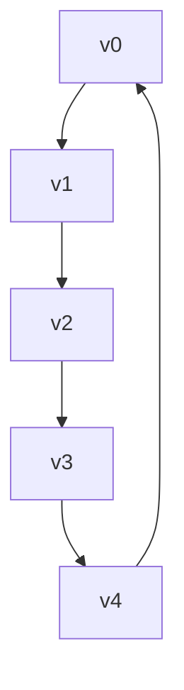
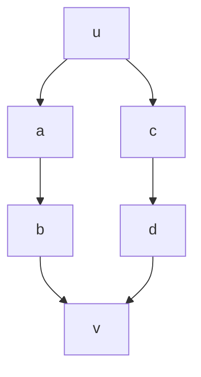
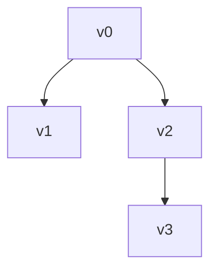
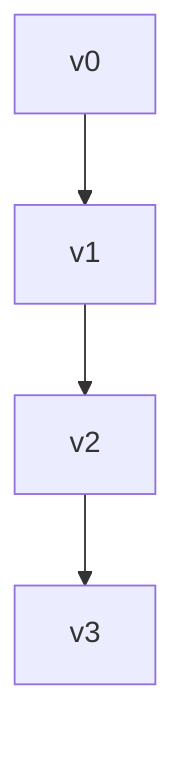
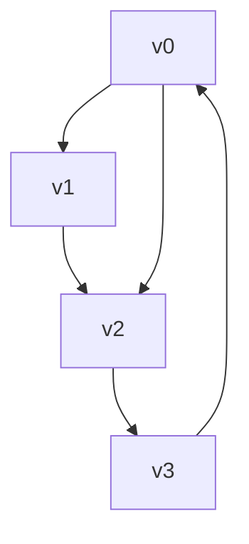

# Math 325 Portfolio - Joshua Burgenmeyer <!-- omit in toc -->

## Goals
- Apply topics from this class into other classes and my life
- Know real world applications for studied theories

## Table of Contents <!-- omit in toc -->

<!-- no toc -->

- [Goals](#goals)
- [Reader Guide](#reader-guide)
- [First Meeting](#first-meeting)
- [Successes](#successes)
- [Challenges](#challenges)
- [Progress](#progress)
- [Graphs](#graphs)
- [FIGURE 1](#figure-1)
- [Closed Walk](#closed-walk)
- [Closed Trail or Circuit](#closed-trail-or-circuit)
- [FIGURE 2](#figure-2)
- [Closed Path or Cycle](#closed-path-or-cycle)
- [Conjecture](#conjecture)
- [Proof](#proof)
- [FIGURE 3](#figure-3)
- [Handshake Lemma](#handshake-lemma)
- [Bipartite Graph](#bipartite-graph)
- [Proofs](#proofs)

## Reader Guide

### First Meeting
This meeting really helped me fully develop my goals for this class. After the meeting I went and made a plan to fulfill my goals and integrate them into my portfolio. Decided on layout

#### Successes
I have learned many things and reinforced my knowledge.

#### Challenges
I have never been that good or interested in proofs. I always thought that they were time consuming and boring. But, after working through many proofs in this class, I've come to realize that it is important to prove and check that theories work. Although I do still think proofs are boring, I've worked through it...

#### Progress
I have been taking notes while in class that will benefit my portfolio.

## Graphs

### FIGURE 1

#### Closed Walk

$$ v_1, v_2, v_3, v_2, v_1 $$

#### Closed Trail or Circuit
- Cant repeat an edge

$$ v_2, v_3, v_1, v_2, v_5, v_4, v_2 $$

### FIGURE 2

#### Closed Path or Cycle

$$ v_1, v_2. v_3, v_1 $$

> Every path is a walk, but not every walk is a path

### Conjecture
Given $v_o$ and $v_e$ vertices in a graph $G = (v, e)$, if there is a **walk** starting at $v_o$ and ending at $v_e$, then there is a **path** starting at $v_o$ and ending at $v_e$.

### Proof

### FIGURE 3

Walk:
$$ v_1, v_2, v_3, v_1, v_4, v_5, v_2, v_6, v_3, v_2, v_7 $$

1. collapse $v_1$ to $v_1$

$$ v_1, v_4, v_5, v_2, v_6, v_3, v_2, v_7 $$

2. collapse $v_2$ to $v_2$

Path:
$$ v_1, v_4, v_5, v_2, v_7 $$

> **Smallest Path:** $v_1, v_2, v_3$
> 
> collapse $v_2$ at the beginning

## Handshake Lemma
In any graph, the sum if the degrees if the vertices is **twice** the number of edges.

Starting with a walk, make a path with the same end:
```py
def walk_to_path(walk):
path = []
visited_index = {}

for v in walk:
if v in visited_index:
cycle_start = visited_index[v]
path = path[:cycle_start + 1]

visited_index = {vertex: i for i, vertex in enumerate(path)}
else:
path.append(v)
visited_index[v] = len(path) - 1

return path

walk = ['A', 'B', 'C', 'B', 'D', 'E', 'C', 'F']
path = walk_to_path(walk)

print("Walk:", walk)
print("Converted Path:", path)
```

## Bipartite Graph

# Proofs

## 1. Direct — Graph with Degree 2 is a Cycle

### Statement:
If $G$ is a connected graph and $\Delta(G) = \delta(G) = 2$, then $G$ is a cycle.

### Proof Steps:
1. **Given:** Every vertex $v \in V(G)$ has exactly 2 neighbors.
   - Degree 2 ensures no branching at any vertex.
2. **Select a starting vertex** $v_0$.
   - Choice is arbitrary; the argument works from any vertex.
3. **Traverse along neighbors**: go to an unvisited neighbor, continue walking through the graph.
   - Each vertex has exactly one unvisited edge forward due to degree 2.
4. **Finiteness ensures repetition:** Eventually, a vertex repeats, because the graph is finite.
   - Repetition creates a loop, which is the cycle.
5. **Connectivity ensures all vertices are included**, forming a single cycle.
   - Without connectivity, traversal might not cover all vertices.

### Diagram:



### Application:
- Ring network topologies in computer networks
- Cyclic molecular structures in chemistry
- Fault detection in circuits and loop-based processes

## 2. Contrapositive — Non-Cut Edge Implies Multiple Paths

### Statement:
If an edge $(u,v)$ is not a cut edge in a connected graph $G$, then there is more than one path between $u$ and $v$.

### Proof Steps:
1. **Assume the contrapositive:** There is exactly one path $P$ between $u$ and $v$.
   - Proving the contrapositive often simplifies reasoning.
2. **Take any edge** $e$ on path $P$.
   - Every edge on the unique path is necessary for connectivity.
3. **Remove $e$ from the graph.**
   - Removal tests whether $e$ is critical to connectivity.
4. **Observe:** $u$ and $v$ become disconnected.
   - This shows $e$ is a cut edge.
5. **Conclude:** By contrapositive logic, if an edge is not a cut edge, there must be more than one path connecting its endpoints.

### Diagram:



### Application:
- Network redundancy analysis
- Identifying critical bridges in infrastructure
- Algorithms for bridge detection in graphs

## 3. Contradiction — Every Tree Has Leaves

### Statement:
Every tree with 2 or more vertices has at least one leaf.

### Proof Steps:
1. **Assume the contrary:** Tree $T$ has ≥2 vertices and no leaves (all degrees ≥2).
   - Contradiction begins by assuming the opposite.
2. **Pick any vertex** $v_0$.
   - Starting point is arbitrary.
3. **Construct a path** from $v_0$, always moving to an unvisited neighbor.
   - Degree ≥2 guarantees an unused edge at each vertex.
4. **Finiteness implies repetition:** Eventually a vertex repeats.
   - Repetition forms a cycle.
5. **Contradiction:** Trees are acyclic; therefore, assumption is false. Tree must have a leaf.
   - Logic relies on properties of trees (acyclic, connected).

### Diagram:



### Application:
- File systems: leaf nodes represent files
- Decision trees: leaves represent outcomes
- Data structures: leaves mark endpoints in recursion

## 4. Induction — Tree with n Vertices Has n−1 Edges

### Statement:
If $T$ is a tree with $n$ vertices, then it has $n-1$ edges.

### Proof Steps:
1. **Base Case $n=1$:** One vertex, 0 edges.
   - Base case validates induction start.
2. **Inductive Hypothesis:** Assume all trees with $k$ vertices have $k-1$ edges.
   - IH is the foundation for step from $k$ to $k+1$.
3. **Consider tree with $k+1$ vertices.**
4. **Remove a leaf vertex $v$ and its edge:** Remaining tree has $k$ vertices.
   - Removing a leaf preserves tree properties: connected and acyclic.
5. **Apply IH:** Remaining tree has $k-1$ edges.
6. **Add back removed edge:** Total edges = $k$, which equals $(k+1)-1$.
   - Induction step complete.
7. **Conclusion:** Holds for all $n\ge1$.

### Diagram:



### Application:
- Spanning trees in networks
- Minimum connections in infrastructure
- BFS/DFS traversals in tree data structures

## 5. Constructive — Euler Circuit in Even-Degree Connected Graph

### Statement

If a connected graph $G$ has all vertices of even degree, then $G$ has an Euler circuit.

### Proof Steps:
1. **Select starting vertex** $v_0$.
   - Starting vertex does not affect existence of circuit.
2. **Traverse edges one at a time**, marking them as used.
   - Edge marking ensures each edge is visited exactly once.
3. **At each vertex $v$:** There is always an unused edge to leave $v$.
   - Even degree ensures entry=exit; we never get stuck.
4. **Continue traversal until returning to $v_0$.**
5. **Check for unused edges:** If any exist, start a new trail from a vertex on the circuit with unused edges and merge.
   - Ensures complete coverage of all edges.
6. **Result:** Euler circuit exists covering all edges exactly once.

### Diagram:



### Application:
- Route optimization: mail delivery, garbage collection
- Network traversal algorithms
- Circuit design and PCB trace coverage