## MTH 325 Portfolio <!-- omit in toc -->

**Joshua Burgenmeyer**

This portfolio demonstrates my understanding of the course material and displays my progress towards my class goals. Inside this portfolio, there are class topics with concept explanations, notes for understanding, python implementations, and real-world applications. There are also proofs with various different proving techniques pertaining to the concepts and conjectures learned this semester.

---

## Goals

- Apply class concepts into other courses
- Find applications of class topics into my life
- Know real world applications for studied theories
- Strengthen my ability to write formal mathematical proofs

---

<h2 id="table-of-contents" style="scroll-margin-top:120px;">Table of Contents</h2>

- [Goals](#goals)
- [Reader Guide](#reader-guide)
  - [First Project Check](#first-project-check)
    - [Progress](#progress)
    - [Challenges](#challenges)
    - [Next Steps](#next-steps)
- [Graphs](#graphs)
    - [Closed Walk](#closed-walk)
    - [Closed Trail or Circuit](#closed-trail-or-circuit)
    - [Closed Path or Cycle](#closed-path-or-cycle)
      - [Notes](#notes)
- [Handshake Lemma](#handshake-lemma)
      - [Notes](#notes-1)
- [Representations of Graphs](#representations-of-graphs)
  - [Adjacency Matrix](#adjacency-matrix)
  - [Adjacency List](#adjacency-list)
- [Hakimi–Havel Algorithm](#hakimihavel-algorithm)
  - [Statement](#statement)
  - [Concept and Math](#concept-and-math)
    - [Understanding](#understanding)
  - [Diagram Example](#diagram-example)
  - [Application](#application)
      - [Algorithm Code](#algorithm-code)
      - [Notes](#notes-2)
- [Reverse Hakimi-Havel Algorithm](#reverse-hakimi-havel-algorithm)
  - [Statement](#statement-1)
  - [Concept and Math](#concept-and-math-1)
    - [Understanding](#understanding-1)
  - [Diagram](#diagram)
  - [Applications](#applications)
      - [Notes](#notes-3)
- [Bipartite Graphs](#bipartite-graphs)
  - [Statement](#statement-2)
  - [Concept and Math](#concept-and-math-2)
    - [Definition Setup](#definition-setup)
    - [Understanding:](#understanding-2)
    - [Key Theorem](#key-theorem)
    - [Why Odd Cycles Break Bipartite Graphs](#why-odd-cycles-break-bipartite-graphs)
    - [Understanding:](#understanding-3)
    - [Example: Even Cycle is Bipartite](#example-even-cycle-is-bipartite)
    - [Understanding:](#understanding-4)
    - [Example: Odd Cycle is NOT Bipartite](#example-odd-cycle-is-not-bipartite)
    - [Understanding:](#understanding-5)
    - [Algorithmic Test for Bipartite Graphs (Using BFS)](#algorithmic-test-for-bipartite-graphs-using-bfs)
    - [Understanding:](#understanding-6)
  - [Real World Applications](#real-world-applications)
  - [Summary](#summary)
      - [Notes](#notes-4)
- [Weighted Graph](#weighted-graph)
      - [Notes](#notes-5)
- [Adjacency Matrix](#adjacency-matrix-1)
      - [Notes](#notes-6)
- [Tree](#tree)
      - [Notes](#notes-7)
- [Cut Edge](#cut-edge)
      - [Notes](#notes-8)
- [Non-Cut Edge](#non-cut-edge)
      - [Notes](#notes-9)
- [Forest](#forest)
  - [Key Properties](#key-properties)
  - [Example](#example)
      - [Notes](#notes-10)
- [Graph Theory Foundations](#graph-theory-foundations)
  - [Statement](#statement-3)
  - [Concept and Math](#concept-and-math-3)
  - [Understanding](#understanding-7)
  - [Application](#application-1)
- [Conditional Statements](#conditional-statements)
      - [Notes](#notes-11)
- [Kruskal’s Algorithm](#kruskals-algorithm)
      - [Notes](#notes-12)
- [Dijkstra’s Algorithm (DJP)](#dijkstras-algorithm-djp)
      - [Notes](#notes-13)
- [Maximal Graph](#maximal-graph)
      - [Notes](#notes-14)
- [Minimal Graph](#minimal-graph)
      - [Notes](#notes-15)
      - [Notes](#notes-16)
- [Strongly Connected (Directed Graphs)](#strongly-connected-directed-graphs)
      - [Notes](#notes-17)
- [Weakly Connected (Directed Graphs)](#weakly-connected-directed-graphs)
      - [Notes](#notes-18)
- [Reflexive Relations](#reflexive-relations)
      - [Notes](#notes-19)
- [Irreflexive (Antireflexive) Relations](#irreflexive-antireflexive-relations)
      - [Notes](#notes-20)
- [Symmetric Relations](#symmetric-relations)
      - [Notes](#notes-21)
- [Antisymmetric Relations](#antisymmetric-relations)
      - [Notes](#notes-22)
- [Transitive Relations](#transitive-relations)
      - [Notes](#notes-23)
- [Equivalence Relations](#equivalence-relations)
      - [Notes](#notes-24)
- [Partitions](#partitions)
      - [Notes](#notes-25)
- [Hierholzer’s Algorithm](#hierholzers-algorithm)
  - [Key Idea](#key-idea)
  - [How the Algorithm Works](#how-the-algorithm-works)
  - [Why It Works](#why-it-works)
  - [Output](#output)
  - [Applications](#applications-1)
      - [Notes](#notes-26)
- [Dijkstra’s Algorithm](#dijkstras-algorithm)
  - [Key Idea](#key-idea-1)
  - [How It Works](#how-it-works)
  - [Output](#output-1)
  - [Applications](#applications-2)
      - [Notes #1 Notes #2](#notes-1-notes-2)
- [Hamilton Cycles and Paths](#hamilton-cycles-and-paths)
  - [Key Facts](#key-facts)
  - [Applications](#applications-3)
      - [Notes #1 Notes #2](#notes-1-notes-2-1)
- [Planar Graphs](#planar-graphs)
  - [Key Facts](#key-facts-1)
  - [Applications](#applications-4)
      - [Notes](#notes-27)
- [Max-Cut Problem](#max-cut-problem)
  - [Key Facts](#key-facts-2)
  - [Applications](#applications-5)
      - [Notes](#notes-28)
- [Proofs by Type](#proofs-by-type)
  - [Direct Proof](#direct-proof)
  - [Proof by Contradiction](#proof-by-contradiction)
  - [Proof by Contrapositive](#proof-by-contrapositive)
  - [Proof by Strong Induction](#proof-by-strong-induction)
  - [Constructive Proof](#constructive-proof)
- [**Proofs**](#proofs)
- [1. Direct — Graph with Degree 2 is a Cycle](#1-direct--graph-with-degree-2-is-a-cycle)
  - [Statement](#statement-4)
  - [Proof Steps](#proof-steps)
  - [Application](#application-2)
- [2. Contrapositive — Non-Cut Edge Implies Multiple Paths](#2-contrapositive--non-cut-edge-implies-multiple-paths)
  - [Statement](#statement-5)
  - [Proof Steps](#proof-steps-1)
  - [Application](#application-3)
- [3. Contradiction — Every Tree Has Leaves](#3-contradiction--every-tree-has-leaves)
  - [Statement](#statement-6)
  - [Proof Steps](#proof-steps-2)
  - [Application](#application-4)
- [4. Induction — Tree with n Vertices Has n−1 Edges](#4-induction--tree-with-n-vertices-has-n1-edges)
  - [Statement](#statement-7)
  - [Proof Steps](#proof-steps-3)
  - [Application](#application-5)
- [5. Constructive — Euler Circuit in Even-Degree Connected Graph](#5-constructive--euler-circuit-in-even-degree-connected-graph)
  - [Statement](#statement-8)
  - [Proof Steps](#proof-steps-4)
  - [Application](#application-6)
- [6. Contradiction - Every Tree Has Exactly One Path Between Two Vertices](#6-contradiction---every-tree-has-exactly-one-path-between-two-vertices)
  - [Statement](#statement-9)
  - [Proof](#proof)
  - [Explanation](#explanation)
  - [Application](#application-7)
- [7. Contradiction - Every Tree Has Leaves](#7-contradiction---every-tree-has-leaves)
  - [Statement](#statement-10)
  - [Proof](#proof-1)
  - [Explanation](#explanation-1)
  - [Application](#application-8)
- [8. Direct - If δ(G) ≥ 2 Then G Contains a Cycle](#8-direct---if-δg--2-then-g-contains-a-cycle)
  - [Statement](#statement-11)
  - [Proof](#proof-2)
  - [Explanation](#explanation-2)
  - [Application](#application-9)
- [9. Direct - If abs(E) ≥ n Then G Has a Cycle](#9-direct---if-abse--n-then-g-has-a-cycle)
  - [Statement](#statement-12)
  - [Proof](#proof-3)
  - [Explanation](#explanation-3)
  - [Application](#application-10)
- [10. Constructive - Euler Circuit in Even-Degree Connected Graph](#10-constructive---euler-circuit-in-even-degree-connected-graph)
  - [Statement](#statement-13)
  - [Proof (Constructive)](#proof-constructive)
  - [Explanation](#explanation-4)
  - [Application](#application-11)
- [Algorithms with Code](#algorithms-with-code)
  - [Hakimi–Havel Algorithm](#hakimihavel-algorithm-1)
  - [Dijkstra’s Algorithm](#dijkstras-algorithm-1)
  - [Floyd–Warshall Algorithm](#floydwarshall-algorithm)
  - [Kruskal’s Algorithm](#kruskals-algorithm-1)
  - [Greedy Graph Coloring](#greedy-graph-coloring)
  - [Depth-First Search (DFS)](#depth-first-search-dfs)
  - [Ford–Fulkerson Algorithm](#fordfulkerson-algorithm)
- [Citations](#citations)


---

## Reader Guide

### First Project Check
This meeting really helped me fully develop my goals for this class. After the meeting I went and made a plan to fulfill my goals and integrate into my portfolio layout.

#### Progress
- Written my learning goals
- Created the structure of my portfolio
- Added proofs
- Written scripts

#### Challenges
- Writing proofs
- Making graphs in Markdown

#### Next Steps
- Add more note entries
- Add more topics
- Add more formal proofs
- Add more real-world applications

---

## Graphs

A **graph** is a structure made of:
- A set of **vertices** (nodes)
- A set of **edges** connecting vertices

Mathematically:

$$ G = (V, E) $$

Where:
- V is the vertex set  
- E is the edge set  

#### Closed Walk

$$ v_1, v_2, v_3, v_2, v_1 $$

#### Closed Trail or Circuit
*Cant repeat an edge*

$$ v_2, v_3, v_1, v_2, v_5, v_4, v_2 $$

#### Closed Path or Cycle

$$ v_1, v_2. v_3, v_1 $$

> Every path is a walk, but not every walk is a path

##### [Notes](/notes/982025-Wells.png)

---

## Handshake Lemma
In any graph, the sum if the degrees if the vertices is **twice** the number of edges.

Starting with a walk, make a path with the same end:
```py
def walk_to_path(walk):
path = []
visited_index = {}

for v in walk:
if v in visited_index:
cycle_start = visited_index[v]
path = path[:cycle_start + 1]

visited_index = {vertex: i for i, vertex in enumerate(path)}
else:
path.append(v)
visited_index[v] = len(path) - 1

return path

walk = ['A', 'B', 'C', 'B', 'D', 'E', 'C', 'F']
path = walk_to_path(walk)

print("Walk:", walk)
print("Converted Path:", path)
```

##### [Notes](/notes/982025-Wells.png)

---

## Representations of Graphs

### Adjacency Matrix

- A 2D array
- Matrix[i][j] = 1 if an edge exists
- Uses more memory  
- Best for dense graphs  

### Adjacency List

- Dictionary or list of neighbors  
- Uses less memory  
- Best for sparse graphs  
- Faster neighbor lookups  

---

## Hakimi–Havel Algorithm

### Statement
The Hakimi–Havel algorithm determines whether a given degree sequence corresponds to a simple graph.

### Concept and Math

1. Start with a degree sequence sorted in non-increasing order.  
2. Remove the first degree `d` (largest).  
3. Subtract 1 from the next `d` degrees in the sequence.  
4. Repeat until all degrees are zero or the sequence becomes invalid.  
5. If all degrees reduce to zero → sequence is graphical; otherwise → not graphical.

#### Understanding
- The algorithm repeatedly “connects” the vertex with the highest degree to the next vertices.  
- If the sequence can be reduced to all zeros, the connections are possible in a simple graph.

### Diagram Example

```mermaid!
%%{init: { 
    "theme": "default",
    "flowchart": { "useMaxWidth": false },
    "themeVariables": { "fontSize": 12, "nodePadding": 5, "edgeMargin": 5 }
}}%%
graph TD
A[Degree Sequence: 3,2,2,2,1] --> B[Remove 3, subtract 1 from next 3]
B --> C[New Sequence: 1,1,1,1]
C --> D[Remove 1, subtract 1 from next 1]
D --> E[New Sequence: 0,1,1]
E --> F[Remove 1, subtract 1 from next 1]
F --> G[New Sequence: 0,0,1]
G --> H[Remove 1, subtract 1 from next 1]
H --> I[Sequence Invalid → Not Graphical]
```



### Application
- Network testing
- Social network analysis
- Generating valid test graphs for algorithms

##### [Algorithm Code](#hakimihavel-algorithm-1)

##### [Notes](/notes/91025-Wells.png)

---

## Reverse Hakimi-Havel Algorithm

### Statement
The Reverse Hakimi–Havel algorithm constructs a simple graph from a valid degree sequence.

### Concept and Math
1. Start with a valid degree sequence sorted in non-increasing order.
2. Take the vertex with the largest degree `d`.
3. Connect it to the next `d` vertices in the sequence.
4. Decrease the degree of connected vertices accordingly.
5. Repeat until all vertices have degree 0.

#### Understanding
- This algorithm is the constructive inverse of Hakimi–Havel.
- It produces an actual simple graph corresponding to the degree sequence.

### Diagram


### Applications
- Graph construction from degree sequences
- Modeling networks
- Generating graphs for testing or simulations

##### [Notes](/notes/91225-Wells.png)

---

## Bipartite Graphs

### Statement  
A graph $G = (V, E)$ is **bipartite** if its vertex set can be split into two disjoint sets  
$V_1$ and $V_2$ such that **every edge connects a vertex in $V_1$ to one in $V_2$**, and **no edge connects two vertices within the same set**.

### Concept and Math

#### Definition Setup  
Let
$$
V = V_1 \cup V_2
$$
where:
- $V_1 \cap V_2 = \emptyset$
- Every edge $(u, v) \in E$ satisfies:
  - $u \in V_1$ and $v \in V_2$, or
  - $u \in V_2$ and $v \in V_1$

#### Understanding:
We split all vertices into exactly **two groups**, and edges are only allowed to go **between groups**, never inside the same group.

#### Key Theorem
> A graph is bipartite **if and only if** it contains **no odd-length cycles**.

#### Why Odd Cycles Break Bipartite Graphs

Suppose we try to 2-color a cycle:

- Start coloring alternating vertices:
  - Red, Blue, Red, Blue, ...

If the cycle length is **odd**, the last vertex must match the **first color**, which creates a conflict.

#### Understanding:
Bipartite graphs require a clean alternating structure. Odd cycles force a same-color collision.

#### Example: Even Cycle is Bipartite

Cycle $C_4$:

Vertices:
$$
V = \{v_1, v_2, v_3, v_4\}
$$

Edges:
$$
(v_1,v_2), (v_2,v_3), (v_3,v_4), (v_4,v_1)
$$

Partition:
$$
V_1 = \{v_1, v_3\}, \quad V_2 = \{v_2, v_4\}
$$

All edges go across the sets — therefore **bipartite**.

#### Understanding:
Even cycles always work because alternating assignments close cleanly.

#### Example: Odd Cycle is NOT Bipartite

Cycle $C_3$ (triangle):

Vertices:
$$
\{a, b, c\}
$$

Edges:
$$
(a,b), (b,c), (c,a)
$$

Try coloring:
- $a$ → Red
- $b$ → Blue
- $c$ → Red

But edge $(c,a)$ connects **Red → Red** → violates bipartite rule.

#### Understanding:
Odd cycles force same-group connections, which bipartite graphs forbid.

#### Algorithmic Test for Bipartite Graphs (Using BFS)

1. Pick a starting vertex.
2. Color it Red.
3. Color all neighbors Blue.
4. Continue alternating colors using BFS or DFS.
5. If any edge connects same-colored vertices → graph is **not bipartite**.

#### Understanding:
This works because BFS explores by layers, which naturally match bipartite structure.

### Real World Applications

**Matching Problems (Job Assignments, Dating Apps, College Admissions)**
- One group = people  
- Other group = jobs/schools  
- Edges = possible matches  
This leads directly to **maximum bipartite matching algorithms**.

**Scheduling and Resource Allocation**
- One side = tasks  
- Other side = machines/resources  
Ensures no resource conflict.

**Computer Networking**
- Client-server architectures naturally form bipartite structures.

**Database Relationships**
- Tables linked through foreign keys form bipartite graphs.

**Operating Systems**
- Processes vs resources → bipartite graph for deadlock detection.

### Summary

- Bipartite graphs split vertices into **two non-overlapping groups**
- **No edges within the same group**
- **No odd cycles**
- Easily checked using **BFS coloring**
- Extremely important in **matching, scheduling, networking, and OS design**

##### [Notes](/notes/91225-Wells.png)

---

## Weighted Graph

A **weighted graph** is a graph where each edge has an associated numerical value (weight).
Weights can represent distance, cost, time, or capacity.

**Example**
Vertices: $V = \{A, B, C\}$
Edges with weights: $E = \{(A,B,2), (B,C,3), (A,C,5)\}$

**Applications**
- Shortest path algorithms (Dijkstra, Floyd-Warshall)
- Network routing and traffic optimization

##### [Notes](/notes/91525-Wells.png)

---

## Adjacency Matrix

An **adjacency matrix** is a 2D array representing graph connections.

- Row = source vertex
- Column = target vertex
- Entry = 1 if an edge exists, 0 otherwise (or weight if weighted)

**Example**

|   | A | B | C |
|---|---|---|---|
| A | 0 | 2 | 5 |
| B | 2 | 0 | 3 |
| C | 5 | 3 | 0 |

**Applications**
- Efficient edge lookup
- Useful for dense graphs

##### [Notes](/notes/91525-Wells.png)

---

## Tree

A **tree** is a connected, acyclic graph.  

**Properties**
- Exactly $n-1$ edges for $n$ vertices
- Unique path between any two vertices
- At least one leaf (vertex with degree 1)

**Example**


**Applications**
- File systems
- Decision trees
- Network hierarchies

##### [Notes](/notes/91525-Wells.png)

---

## Cut Edge

A **cut edge** is an edge whose removal **disconnects the graph.**

**Example**

- Removing edge B-C disconnects the graph → B-C is a cut edge

**Applications**
- Network reliability
- Bridge detection in infrastructure

##### [Notes](/notes/91525-Wells.png)

---

## Non-Cut Edge

A **non-cut edge** is an edge whose removal **does not disconnect the graph.**

**Example**


- Removing any edge leaves the graph connected → all are non-cut edges

**Applications**
- Redundant connections in networks
- Ensuring fault tolerance

##### [Notes](/notes/91525-Wells.png)

---

## Forest

A **forest** is a graph with **no cycles**. Equivalently, a forest is a **collection of disjoint trees**.

### Key Properties
- A forest may be **disconnected**
- Each connected component is a **tree**
- If a forest has:
  - $n$ vertices
  - $k$ connected components  
  then it has exactly **$n - k$ edges**

### Example


This graph has:
- 5 vertices
- 2 connected components
- 3 edges

So it satisfies
$|E| = |V| - k = 5 - 2 = 3$

**Applications**
- Modeling multiple independent hierarchies
- Clustering and disjoint-set structures
- Spanning forests in disconnected graphs

##### [Notes](/notes/91525-Wells.png)

---

## Graph Theory Foundations

### Statement

Every connected graph has a spanning tree.

### Concept and Math

A **spanning tree** is a subgraph that:
- Includes every vertex  
- Has no cycles  
- Is connected  

If a graph is connected, a spanning tree can be constructed using Depth-First Search (DFS) or Breadth-First Search (BFS).

### Understanding

We remove edges while keeping the graph connected. The moment a cycle forms, we remove one edge from the cycle. This continues until no cycles remain.

### Application

Spanning trees are used in:
- Network design  
- Circuit wiring  
- Internet routing  
- Minimum infrastructure planning  

---

## Conditional Statements

**Definition:**  
A **conditional statement** (implication) has the form **“If P, then Q”**, written $ P \rightarrow Q $.  
It is **false only when P is true and Q is false**; in every other case it is true.

**Truth Table:**

| P | Q | $P \rightarrow Q$ |
|---|---|---------------------|
| T | T | T |
| T | F | **F** |
| F | T | T |
| F | F | T |

**Key Points:**
- A false hypothesis makes the implication **vacuously true**.
- The **contrapositive** $ \lnot Q \rightarrow \lnot P $ is always logically equivalent.
- The **converse** and **inverse** are *not* logically equivalent to the original statement.

**Example:**  
“If a number is divisible by 6, then it is even.”

**Applications:**  
Logical reasoning, proofs, algorithm correctness, and digital logic design.

##### [Notes](/notes/91725%20-%20Wells.png)

---

## Kruskal’s Algorithm

**Purpose:**  
Find a **Minimum Spanning Tree (MST)** of a weighted, undirected graph by adding the *lightest edges first*.

**How It Works:**
1. Sort all edges in **non-decreasing weight order**.  
2. Create an empty forest (each vertex is its own component).  
3. Repeatedly add the next lightest edge **that does not form a cycle** (use Union-Find / DSU).  
4. Stop when the MST has $ n - 1 $ edges.

**Key Properties:**
- Greedy algorithm.
- Uses **disjoint set union** to detect cycles efficiently.
- Works well for **sparse graphs**.

**Runtime:**  
$ O(E \log E) $ due to sorting.

**Applications:**  
Network design, clustering, cable/road layout, approximation algorithms.

##### [Notes](/notes/92425.png)

---

## Dijkstra’s Algorithm (DJP)

**Purpose:**  
Compute the **shortest path from a source vertex** to all other vertices in a weighted graph with **non-negative edge weights**.

**How It Works:**
1. Initialize distances: `dist[source] = 0`, all others = infinity.  
2. Insert all vertices into a **priority queue** (min-heap).  
3. Repeatedly extract the vertex `u` with the smallest tentative distance.  
4. For each neighbor `v`, relax the edge:  
   $$
   \text{if } \text{dist}[u] + w(u,v) < \text{dist}[v], \text{ update dist}[v]
   $$
5. Continue until all vertices are processed.

**Key Properties:**
- Greedy algorithm.
- Requires **non-negative weights** (fails with negatives).
- Typically implemented with a **binary heap**.

**Runtime:**  
- $ O(E \log V) $ with a min-heap.  
- $ O(V^2) $ with adjacency matrix.

**Applications:**  
GPS routing, internet packet routing, games (pathfinding), network optimization.

##### [Notes](/notes/92425.png)

---

## Maximal Graph

A **maximal graph (with respect to a property)** is a graph that **cannot have any additional edges added without losing that property**.

- Maximal **acyclic graph** = a **tree** (or forest if disconnected).  
- Maximal **planar graph** = adding any edge makes it non-planar.  
- Maximal means “can’t add more edges,” **not** “has the most edges overall**.

**Key idea:**  
> Maximal = edge-addition would break the property.

##### [Notes](/notes/92625.png)

---

## Minimal Graph

A **minimal graph (with respect to a property)** is a graph where **removing any edge destroys that property**.

- Minimal **connected graph** = a **tree** (remove an edge → disconnected).  
- Minimal **2-connected graph** = removing any edge makes it only 1-connected.

**Key idea:**  
> Minimal = edge-removal breaks the property.

##### [Notes](/notes/92625.png)

---

These ideas show how graphs sit on the “boundary” of a property:  
- **Maximal** → can’t add edges  
- **Minimal** → can’t remove edges

##### [Notes](/notes/92625.png)

---

## Strongly Connected (Directed Graphs)

A directed graph $D$ is **strongly connected** if **every vertex can reach every other vertex by a directed path**.

- For all vertices $u, v$: there exists a path $u \rightarrow v$ **and** $v \rightarrow u$.
- Strong connectivity means full two-way reachability.
- Strongly connected components (SCCs) are maximal subgraphs that satisfy this.

**Key idea:**  
> Direction matters, and you must be able to travel both ways.

##### [Notes](/notes/10625-Wells.png)

---

## Weakly Connected (Directed Graphs)

A directed graph $D$ is **weakly connected** if, when you **ignore edge directions**, the underlying undirected graph is connected.

- Treated as an undirected graph → all vertices are still connected.
- Does *not* require directed paths.
- A strongly connected graph is always weakly connected, but not the reverse.

**Key idea:**  
> Connected when directions are removed, but not necessarily with directed paths.

##### [Notes](/notes/10625-Wells.png)

---

## Reflexive Relations
A relation $R$ on a set $A$ is **reflexive** if every element relates to itself.  
- For all $a \in A$, $(a, a) \in R$.  
- Example: equality $=$ is reflexive.

**Key idea:**  
> Everyone points to themselves.

##### [Notes](/notes/102225-Wells.png)

---

## Irreflexive (Antireflexive) Relations
A relation $R$ on a set $A$ is **irreflexive** if no element relates to itself.  
- For all $a \in A$, $(a, a) \notin R$.  
- Example: the “less than” relation $<$.

**Key idea:**  
> Nobody points to themselves.

##### [Notes](/notes/102225-Wells.png)

---

## Symmetric Relations
A relation $R$ is **symmetric** if every connection works both ways.  
- If $(a, b) \in R$, then $(b, a) \in R$.  
- Example: “is a sibling of.”

**Key idea:**  
> If you relate to me, I relate to you.

##### [Notes](/notes/102225-Wells.png)

---

## Antisymmetric Relations
A relation $R$ is **antisymmetric** if the only way both $(a, b)$ and $(b, a)$ can be in $R$ is if $a = b$.  
- Allows one-directional connections but forbids two-way unless identical.  
- Example: “less than or equal” $\le$.

**Key idea:**  
> Two-way relations only happen when the elements are the same.

##### [Notes](/notes/102225-Wells.png)

---

## Transitive Relations
A relation $R$ is **transitive** if it passes connections along.  
- If $(a, b) \in R$ and $(b, c) \in R$, then $(a, c) \in R$.  
- Example: “is an ancestor of.”

**Key idea:**  
> If A relates to B and B to C, then A must relate to C.

##### [Notes](/notes/102225-Wells.png)

---

## Equivalence Relations
A relation is an **equivalence relation** if it is:
1. Reflexive  
2. Symmetric  
3. Transitive  

These relations group elements into “equivalent” categories.  
- Example: congruence modulo $n$.

**Key idea:**  
> Behaves like an equality test that might group many distinct items together.

##### [Notes](/notes/102225-Wells.png)

---

## Partitions
A **partition** of a set $A$ is a collection of **non-overlapping**, **non-empty** subsets whose union is all of $A$.

- Every element is in exactly one block.  
- Every equivalence relation corresponds to a unique partition, and vice versa.

**Key idea:**  
> Break the set into disjoint groups where each element belongs to one and only one group.

##### [Notes](/notes/102225-Wells.png)

---

## Hierholzer’s Algorithm

**Purpose:**  
Hierholzer’s Algorithm is used to find an **Euler circuit** (a cycle that uses every edge exactly once) in a graph where **every vertex has even degree** and the graph is connected.

### Key Idea
Instead of trying to build the entire Euler circuit at once, the algorithm constructs **small cycles** and then **merges** them together.

### How the Algorithm Works
1. **Start at any vertex** in the graph.  
2. **Follow unused edges**, forming a cycle, until returning to the start vertex.  
   - You will never get stuck early because all degrees are even.  
3. If **unused edges remain**, choose a vertex on the current cycle that has unused edges.  
4. Build a **new cycle** from that vertex and merge it into the existing one.  
5. Continue until **all edges have been used**.

### Why It Works
- Even degrees guarantee every time you enter a vertex, you can leave it using another unused edge.  
- Merging cycles preserves edge usage and ensures no edge is skipped.

### Output
A complete Euler circuit that uses every edge exactly once.

### Applications
- Route optimization (postal routing, garbage collection).  
- DNA sequencing reconstruction.  
- Network traversal and circuit design.  

##### [Notes](/notes/102925%20-%20Wells.png)

---

## Dijkstra’s Algorithm

**Purpose:**  
Dijkstra’s Algorithm finds the **shortest path** from a starting vertex to all other vertices in a **weighted graph with non-negative edge weights**.

### Key Idea
It expands outward from the start vertex, always choosing the **closest unvisited vertex** next, guaranteeing minimal distances.

### How It Works
1. Assign distance 0 to the start vertex and ∞ to all others.  
2. Mark all vertices unvisited.  
3. Select the unvisited vertex with the **smallest tentative distance**.  
4. Update the distances of its neighbors using relaxation.  
5. Mark the selected vertex as visited.  
6. Repeat until all vertices are processed.

### Output
- A shortest-path tree rooted at the starting vertex.  
- The shortest distance to each vertex.  

### Applications
- GPS routing.  
- Network packet routing.  
- Pathfinding in games (A*, navigation grids).

##### [Notes #1](/notes/11325-Wells.png) [Notes #2](/notes/11525.png) 

---

## Hamilton Cycles and Paths

**Definition:**  
- A **Hamiltonian cycle** is a Hamiltonian path that **returns to the starting vertex**, forming a closed loop.
- A **Hamiltonian path** is a path in a graph that visits **every vertex exactly once**.  

### Key Facts
- Hamiltonian cycles and paths exist in both directed and undirected graphs.  
- Determining existence is **NP-complete**.  
- Not every graph with a Hamiltonian path has a Hamiltonian cycle.  
- Sufficient conditions for a Hamiltonian cycle exist (e.g., Dirac’s and Ore’s theorems).

### Applications
- Traveling Salesman Problem (TSP).  
- Scheduling problems.  
- Circuit layout design.  
- Genome assembly and computational biology.

##### [Notes #1](/notes/11525.png) [Notes #2](/notes/11725%20-%20Hamilton%20Cycle.png)

---

## Planar Graphs

**Definition:**  
A **planar graph** is a graph that can be drawn on a plane **without any edges crossing**.  

### Key Facts
- Euler's formula for connected planar graphs:  
  $$ V - E + F = 2 $$  
  where $V$ = number of vertices, $E$ = number of edges, $F$ = number of faces.  
- Kuratowski's theorem: A graph is non-planar if it contains a subgraph that is a subdivision of **K₅** or **K₃,₃**.  
- Max edges in a planar simple graph: $E \le 3V - 6$ for $V \ge 3$.

### Applications
- Circuit design and PCB layout.  
- Geographic mapping (no overlapping roads).  
- Network visualization and graph drawing algorithms.

##### [Notes](/notes/111425-Planar%20Graph.png)

---

## Max-Cut Problem

**Definition:**  
The **Max-Cut problem** is to partition the vertices of a graph $G = (V, E)$ into two disjoint subsets $S$ and $V \setminus S$ such that the **number (or total weight) of edges between the subsets is maximized**.

---

### Key Facts
- Max-Cut is an **NP-hard problem**.  
- Exact solutions are computationally expensive for large graphs.  
- Approximation algorithms exist:
  - **Goemans-Williamson algorithm**: uses semidefinite programming, guarantees at least ~0.878 of optimal.

---

### Applications
- VLSI design (minimizing connections inside modules).  
- Statistical physics (Ising model).  
- Network clustering and community detection.

##### [Notes](/notes/111925-maxCut.png)

---

## Proofs by Type

Each proof includes a **statement, proof steps, explanation, and application.**

---

### Direct Proof

**Statement:** The sum of two even numbers is even.

**Proof:**
Let a = 2k and b = 2m. Then:

a + b = 2k + 2m = 2(k + m)

Which is divisible by 2, so it is even.

**Understanding:** We directly use the definition of even.

**Application:** Used constantly in algorithm correctness proofs.

---

### Proof by Contradiction

**Statement:** There is no largest prime number.

**Idea:** Assume the opposite is true, construct a contradiction.

**Application:** Used in security and cryptography.

---

### Proof by Contrapositive

**Statement:** If n² is even, then n is even.

**Contrapositive:** If n is odd, then n² is odd.

**Application:** Logic circuit design and optimization.

---

### Proof by Strong Induction

**Statement:** Every integer n ≥ 2 can be written as a product of primes.

**Application:** Used in number theory and cryptographic security.

---

### Constructive Proof

**Statement:** If a graph $G$ has minimum degree $𝛿(G) ≥ 2$, then $G$ contains a cycle.

**Constructive Idea:** Start at any vertex and walk along unused edges, always choosing a new edge when possible.
Because every vertex has degree at least 2, this walk cannot get stuck unless it revisits a previous vertex—at which point a cycle is formed.

**Construction:**
1. Begin at any vertex $v_0$.
2. Repeatedly move to a neighbor you have not yet arrived from, forming a path $v_0, v_1,...,v_k$.
3. Since each vertex has ≥2 neighbors, the endpoint $v_k$ must have a neighbor in the previously visited part of the path.
4. The edge connecting $v_k$ to an earlier vertex closes a cycle.

This procedure **explicitly constructs** a cycle. 

**Application:** Cycle-detection algorithms, graph traversal routines, and routing systems that rely on guaranteed loop formation.

---

## **Proofs**

Proving conjectures. 

---

## 1. Direct — Graph with Degree 2 is a Cycle

### Statement
If $G$ is a connected graph and $\Delta(G) = \delta(G) = 2$, then $G$ is a cycle.

### Proof Steps
1. **Given:** Every vertex $v \in V(G)$ has exactly 2 neighbors.
   - Degree 2 ensures no branching at any vertex.
2. **Select a starting vertex** $v_0$.
   - Choice is arbitrary; the argument works from any vertex.
3. **Traverse along neighbors**: go to an unvisited neighbor, continue walking through the graph.
   - Each vertex has exactly one unvisited edge forward due to degree 2.
4. **Finiteness ensures repetition:** Eventually, a vertex repeats, because the graph is finite.
   - Repetition creates a loop, which is the cycle.
5. **Connectivity ensures all vertices are included**, forming a single cycle.
   - Without connectivity, traversal might not cover all vertices.

### Application
- Ring network topologies in computer networks
- Cyclic molecular structures in chemistry
- Fault detection in circuits and loop-based processes

---

## 2. Contrapositive — Non-Cut Edge Implies Multiple Paths

### Statement
If an edge $(u,v)$ is not a cut edge in a connected graph $G$, then there is more than one path between $u$ and $v$.

### Proof Steps
1. **Assume the contrapositive:** There is exactly one path $P$ between $u$ and $v$.
   - Proving the contrapositive often simplifies reasoning.
2. **Take any edge** $e$ on path $P$.
   - Every edge on the unique path is necessary for connectivity.
3. **Remove $e$ from the graph.**
   - Removal tests whether $e$ is critical to connectivity.
4. **Observe:** $u$ and $v$ become disconnected.
   - This shows $e$ is a cut edge.
5. **Conclude:** By contrapositive logic, if an edge is not a cut edge, there must be more than one path connecting its endpoints.

### Application
- Network redundancy analysis
- Identifying critical bridges in infrastructure
- Algorithms for bridge detection in graphs

---

## 3. Contradiction — Every Tree Has Leaves

### Statement
Every tree with 2 or more vertices has at least one leaf.

### Proof Steps
1. **Assume the contrary:** Tree $T$ has ≥2 vertices and no leaves (all degrees ≥2).
   - Contradiction begins by assuming the opposite.
2. **Pick any vertex** $v_0$.
   - Starting point is arbitrary.
3. **Construct a path** from $v_0$, always moving to an unvisited neighbor.
   - Degree ≥2 guarantees an unused edge at each vertex.
4. **Finiteness implies repetition:** Eventually a vertex repeats.
   - Repetition forms a cycle.
5. **Contradiction:** Trees are acyclic; therefore, assumption is false. Tree must have a leaf.
   - Logic relies on properties of trees (acyclic, connected).

### Application
- File systems: leaf nodes represent files
- Decision trees: leaves represent outcomes
- Data structures: leaves mark endpoints in recursion

---

## 4. Induction — Tree with n Vertices Has n−1 Edges

### Statement
If $T$ is a tree with $n$ vertices, then it has $n-1$ edges.

### Proof Steps
1. **Base Case $n=1$:** One vertex, 0 edges.
   - Base case validates induction start.
2. **Inductive Hypothesis:** Assume all trees with $k$ vertices have $k-1$ edges.
   - IH is the foundation for step from $k$ to $k+1$.
3. **Consider tree with $k+1$ vertices.**
4. **Remove a leaf vertex $v$ and its edge:** Remaining tree has $k$ vertices.
   - Removing a leaf preserves tree properties: connected and acyclic.
5. **Apply IH:** Remaining tree has $k-1$ edges.
6. **Add back removed edge:** Total edges = $k$, which equals $(k+1)-1$.
   - Induction step complete.
7. **Conclusion:** Holds for all $n\ge1$.

### Application
- Spanning trees in networks
- Minimum connections in infrastructure
- BFS/DFS traversals in tree data structures

---

## 5. Constructive — Euler Circuit in Even-Degree Connected Graph

### Statement

If a connected graph $G$ has all vertices of even degree, then $G$ has an Euler circuit.

### Proof Steps
1. **Select starting vertex** $v_0$.
   - Starting vertex does not affect existence of circuit.
2. **Traverse edges one at a time**, marking them as used.
   - Edge marking ensures each edge is visited exactly once.
3. **At each vertex $v$:** There is always an unused edge to leave $v$.
   - Even degree ensures entry=exit; we never get stuck.
4. **Continue traversal until returning to $v_0$.**
5. **Check for unused edges:** If any exist, start a new trail from a vertex on the circuit with unused edges and merge.
   - Ensures complete coverage of all edges.
6. **Result:** Euler circuit exists covering all edges exactly once.

### Application
- Route optimization: mail delivery, garbage collection
- Network traversal algorithms
- Circuit design and PCB trace coverage

---

## 6. Contradiction - Every Tree Has Exactly One Path Between Two Vertices

### Statement
In any tree $T$, for any two vertices $u$ and $v$, there is **exactly one simple path** connecting $u$ and $v$.

### Proof
1. **Existence:**  
   Trees are connected by definition, so at least one path exists between $u$ and $v$.

2. **Uniqueness:**  
   Suppose there exist two distinct simple paths $P_1$ and $P_2$ between $u$ and $v$. Let $w$ be the first vertex along $P_1$ where the paths diverge. Then $P_1 \cup P_2$ contains a cycle through $w$, contradicting the acyclic property of trees.

3. **Conclusion:**  
   Therefore, there is exactly one simple path between any two vertices in a tree.

### Explanation
- Trees are connected and acyclic.  
- Any two distinct paths would create a cycle, which is impossible in a tree.

### Application
- Ensures uniqueness of routes in network trees.  
- Useful in decision trees and hierarchical data structures.

---

## 7. Contradiction - Every Tree Has Leaves

### Statement
Every tree with 2 or more vertices has at least one leaf (a vertex of degree 1).

### Proof
1. **Assume the contrary:** Suppose all vertices in tree $T$ have degree ≥ 2.  

2. **Construct a maximal path:** Pick any vertex $v_0$ and traverse through unvisited neighbors until no further extension is possible. Let $v_k$ be the endpoint.  

3. **Contradiction:** Since every vertex has degree ≥ 2, $v_k$ must have an unvisited neighbor to continue, contradicting the maximality of the path.  

4. **Conclusion:** There must exist at least one vertex of degree 1 (a leaf).

### Explanation
- Maximal paths in trees must terminate at leaves.  
- Ensures that traversal and induction arguments on trees work correctly.

### Application
- File system hierarchies, decision trees, and endpoint detection in data structures.

---

## 8. Direct - If δ(G) ≥ 2 Then G Contains a Cycle

### Statement
Let $G$ be a finite graph. If every vertex has degree at least 2 ($\delta(G) \ge 2$), then $G$ contains at least one cycle.

### Proof
1. Pick any vertex $v$ and construct a **maximal path** $v_0, v_1, ..., v_k$ such that each edge is visited only once.  

2. Since $\delta(G) \ge 2$, the endpoint $v_k$ has at least two neighbors. At least one neighbor $u$ is already in the path (otherwise the path could be extended, contradicting maximality).  

3. The edge from $v_k$ to $u$ forms a **cycle**.  

4. Conclusion: $G$ contains a cycle.

### Explanation
- The degree condition guarantees that maximal paths cannot terminate without forming a loop.  
- This is constructive: you can find the cycle by following paths until a repeated vertex is reached.

### Application
- Detecting loops in networks or circuits.  
- Algorithm design for cycle detection.

---

## 9. Direct - If abs(E) ≥ n Then G Has a Cycle

### Statement
Let $G=(V,E)$ be a graph with $n$ vertices. If $|E| \ge n$, then $G$ contains at least one cycle.

### Proof
1. Consider a spanning forest $F$ of $G$. A forest with $n$ vertices has at most $n-1$ edges.  

2. If $|E| \ge n$, then $|E| > |F|$.  

3. Adding an edge to a forest always creates a cycle.  

4. Conclusion: $G$ contains a cycle.

### Explanation
- Uses the property that forests are acyclic with maximum $n-1$ edges.  
- Any additional edge necessarily closes a loop.

### Application
- Edge counting for cycle detection.  
- Structural analysis of networks.

---

## 10. Constructive - Euler Circuit in Even-Degree Connected Graph

### Statement
If an undirected connected graph $G$ has **all vertices of even degree**, then $G$ has an **Euler circuit** (a cycle using every edge exactly once).

### Proof (Constructive)
1. Pick any vertex $v_0$. Start walking along edges, never repeating an edge, until returning to $v_0$.  

2. Every time you enter a vertex, there is an unused edge to leave it (even degree property).  

3. If some edges remain unused, start a new walk from a vertex on the circuit that still has unused edges and merge the new walk into the existing circuit.  

4. Continue until all edges are used.  

5. Conclusion: This forms an Euler circuit.

### Explanation
- The even-degree condition guarantees you never get stuck in the middle of a traversal.  
- This is the **Hierholzer’s algorithm** for finding Euler circuits.

### Application
- Routing problems (mail delivery, garbage collection).  
- Network traversal and graph-based puzzles.  

---

## Algorithms with Code

Each algorithm has:
- Statement
- Python file
- Code
- Explanation
- Application

---

### Hakimi–Havel Algorithm

**Purpose:** Determines if a degree sequence corresponds to a simple graph.

**File:** [`hakimi_havel.py`](/scripts/hakimi-havel.py)

**Code:**





**Use Case:** Network feasibility testing.

---

### Dijkstra’s Algorithm

**Purpose:** Finds shortest paths from a source.

**File:** [`dijkstra.py`](/scripts/dijkstra.py)

**Code:**





**Use Case:** GPS systems, packet routing.

---

### Floyd–Warshall Algorithm

**Purpose:** Finds all-pairs shortest paths.

**File:** [`floyd_warshall.py`](/scripts/floyd-warshall.py)

**Code:**





**Use Case:** City-wide routing systems.

---

### Kruskal’s Algorithm

**Purpose:** Finds Minimum Spanning Tree.

**File:** [`kruskal.py`](/scripts/kruskal.py)

**Code:**





**Use Case:** Infrastructure design, wiring layouts.

---

### Greedy Graph Coloring

**Purpose:** Colors vertices so no two adjacent vertices share a color.

**File:** [`greedy_coloring.py`](/scripts/greedy-coloring.py)

**Code:**





**Use Case:** Scheduling, register allocation.

---

### Depth-First Search (DFS)

**Purpose:** Traverses a graph deeply before backtracking.

**File:** [`dfs.py`](/scripts/dfs.py)

**Code:**





**Use Case:** Cycle detection, maze solving.

---

### Ford–Fulkerson Algorithm

**Purpose:** Computes maximum flow in a network.

**File:** [`ford_fulkerson.py`](/scripts/ford-fulkerson.py)

**Code:**





**Use Case:** Traffic flow, data networks.

---

## Citations

- <a href="https://faculty.gvsu.edu/wellsc/discrete/data_structures_done_discretely.html" target="_blank" rel="noopener noreferrer">
  Class Text
</a>
- [Notes](/notes/)